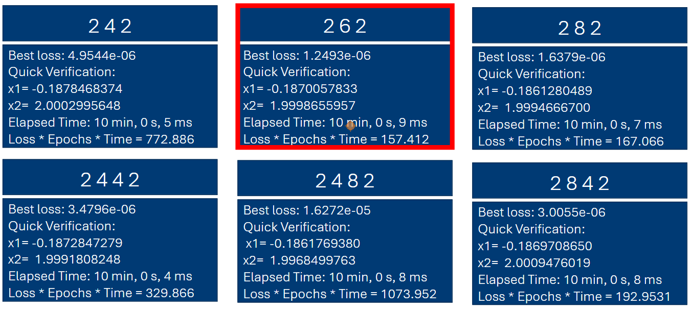
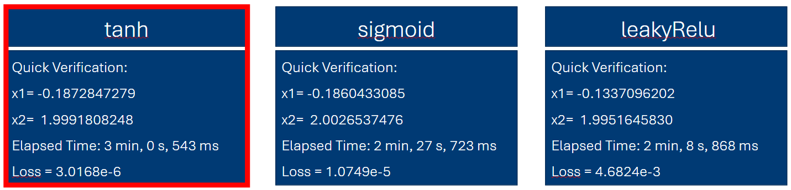
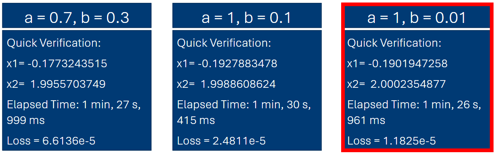

# 🧠 Neural Network from Scratch

> A minimal neural network implementation from scratch — available in both **Python/NumPy** and **MATLAB**. No PyTorch, no TensorFlow, just math.

[](https://python.org)
[](https://numpy.org)
[](https://mathworks.com)
[](LICENSE)

---

## What is this?

This project implements a **fully connected feedforward neural network** entirely from scratch to learn mathematical functions from input-output pairs. No autograd — gradients are computed via **central finite differences**, and weights are updated with **AdamW**.

Solutions are provided in **two implementations**:

- **Python** (`python/`) — pure NumPy, readable and fast
- **MATLAB** (`matlab/`) — original implementation, self-contained

### Two problems are solved:

| | Problem 1 (linear) | Problem 2 (nonlinear) |
|---|---|---|
| **Target** | $x_1 = q_1 + q_2 - 1$ | $x_1 = q_1 + q_2^2 - 1$ |
| | $x_2 = q_1 - q_2 + 1$ | $x_2 = q_1 - q_2 + 1$ |
| **Architecture** | `[2 → 2 → 2 → 2]` | `[2 → 6 → 2]` |
| **Training samples** | 100 | 70 |
| **Convergence target** | Loss < 10⁻¹¹ | Loss < 10⁻⁶ |

---

## Architecture & Hyperparameter Study (Problem 2)

To find the best configuration for the nonlinear problem, three experiments were conducted. The winner of each is highlighted with a red border in the images.

### 1 — Network Architecture Comparison

Six architectures were evaluated using a combined score of **Loss × Epochs × Time** (lower = better) to balance accuracy and training efficiency.



| Architecture | Best Loss | Score |
|---|---|---|
| `[2, 4, 2]` | 4.9544e-06 | 772.9 |
| **`[2, 6, 2]` ✓** | **1.2493e-06** | **157.4** |
| `[2, 8, 2]` | 1.6379e-06 | 167.1 |
| `[2, 4, 4, 2]` | 3.4796e-06 | 329.9 |
| `[2, 4, 8, 2]` | 1.6272e-05 | 1074.0 |
| `[2, 8, 4, 2]` | 3.0055e-06 | 193.0 |

**Result:** `[2, 6, 2]` achieves the lowest loss and the best combined score — one hidden layer with 6 neurons is sufficient for this problem.

### 2 — Hidden Layer Activation Function Comparison

With architecture fixed at `[2, 6, 2]`, three activation functions for the hidden layers were compared.



| Activation | Final Loss | Time |
|---|---|---|
| **Tanh ✓** | **3.0168e-06** | 3 min 0.5 s |
| Sigmoid | 1.0749e-05 | 2 min 27.7 s |
| Leaky ReLU | 4.6824e-03 | 2 min 8.9 s |

**Result:** `tanh` converges to the lowest loss and is used for all hidden layers in the final network.

### 3 — Leaky ReLU Parameter Comparison (Input Layer)

The input layer uses a Leaky ReLU. The negative-slope parameter $b$ was tuned while keeping $a = 1$ (positive slope unchanged).



| Parameters | Final Loss | Time |
|---|---|---|
| a = 0.7, b = 0.3 | 6.6136e-05 | 1 min 28 s |
| a = 1, b = 0.1 | 2.4811e-05 | 1 min 30 s |
| **a = 1, b = 0.01 ✓** | **1.1825e-05** | **1 min 27 s** |

**Result:** A small negative slope (`b = 0.01`) avoids dead neurons while keeping gradient flow close to standard ReLU. This parametrization is used for the input layer in the final network.

### Final Configuration (Problem 2)

| Component | Choice |
|---|---|
| Architecture | `[2, 6, 2]` |
| Input layer | Leaky ReLU (a = 1, b = 0.01) |
| Hidden layers | Tanh |
| Output layer | Identity (linear) |

---

## Project Structure

```
nn-from-scratch/
├── python/
│   ├── activation.py      # Activation functions (ReLU, paraReLU, Sigmoid, Tanh, ELU, Softmax)
│   ├── network.py         # Forward pass, MSE loss, numerical gradient, utilities
│   ├── loesung1.py        # Training script — linear target problem
│   ├── loesung2.py        # Training script — nonlinear target problem
│   └── requirements.txt   # Dependencies (numpy, matplotlib)
├── matlab/
│   ├── Activation.m       # Activation functions
│   ├── myRandVector.m     # Random vector utility
│   ├── loesung1.m         # Training script — linear target problem
│   └── loesung2.m         # Training script — nonlinear target problem
├── architectures_comparison.png
├── hiddenlayers_activationfunktions_comparison.png
├── leakyrelu_parameters_comparison.png
├── .gitignore
├── LICENSE
└── README.md
```

---

## Quick Start

### Python

```bash
# Clone the repo
git clone https://github.com/<your-username>/nn-from-scratch.git
cd nn-from-scratch/python

# Install dependencies
pip install -r requirements.txt

# Run
python loesung1.py   # linear problem
python loesung2.py   # nonlinear problem
```

### MATLAB

Open `matlab/loesung1.m` or `matlab/loesung2.m` in MATLAB and press **Run** (or use `F5`). No additional toolboxes required.

---

## How It Works

### Forward Pass

Each layer computes $z = xW + b$, then applies an activation:

| Layer | Activation |
|---|---|
| Input layer | Leaky ReLU ($a = 1,\ b = 0.01$) |
| Hidden layers | Tanh |
| Output | Linear (identity) |

### Gradient Computation

Since there's no autograd, gradients are approximated numerically using **central differences**:

$$\frac{\partial \mathcal{L}}{\partial w_i} \approx \frac{\mathcal{L}(w_i + \varepsilon) - \mathcal{L}(w_i - \varepsilon)}{2\varepsilon}$$

This is simple and reliable, but scales as $O(n)$ forward passes per step (where $n$ = number of parameters). Fine for small networks — intentionally kept this way for educational clarity.

### AdamW Optimizer

The weight update follows [AdamW (Loshchilov & Hutter, 2019)](https://arxiv.org/abs/1711.05101):

$$m_t = \beta_1 m_{t-1} + (1 - \beta_1) g_t$$

$$v_t = \beta_2 v_{t-1} + (1 - \beta_2) g_t^2$$

$$w_t = w_{t-1} - \frac{\alpha}{\sqrt{\hat{v}_t} + \varepsilon} \hat{m}_t - \alpha \lambda w_{t-1}$$

with bias correction $\hat{m}_t = m_t / (1 - \beta_1^t)$ and $\hat{v}_t = v_t / (1 - \beta_2^t)$.

| Parameter | Value |
|---|---|
| Learning rate $\alpha$ | 0.001 |
| $\beta_1$ | 0.9 |
| $\beta_2$ | 0.999 |
| $\varepsilon$ | 10⁻⁸ |
| Weight decay $\lambda$ | 0.0 |

---

## Available Activation Functions

All implemented in `python/activation.py` and usable via `Activation.<name>(x)`:

| Function | Formula |
|---|---|
| ReLU | $\max(0, x)$ |
| Parametric ReLU | $\alpha^+ x$ if $x > 0$, else $\alpha^- x$ |
| Leaky ReLU | $\max(\alpha x, x)$ |
| Sigmoid | $\frac{1}{1 + e^{-x}}$ |
| Tanh | $\tanh(x)$ |
| ELU | $x$ if $x \geq 0$, else $\alpha(e^x - 1)$ |
| Softmax | $\frac{e^{x_i}}{\sum_j e^{x_j}}$ |

---

## Customization

Want to experiment? The key knobs are at the top of each training script:

```python
ARCH = [2, 6, 2]        # change network topology
ALPHA = 0.001           # learning rate
WEIGHT_DECAY = 0.0      # L2 regularization strength
NUMBER_OF_EPOCHS = 10**5
```

You can also swap activations in `python/network.py` → `forward()`.

---

